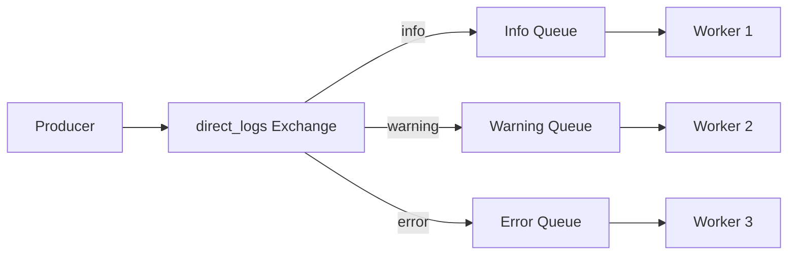
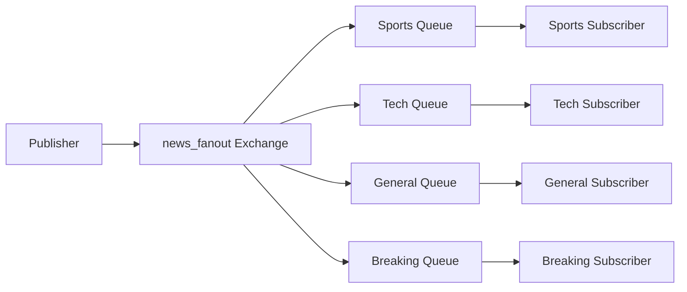

## Patrones Implementados

### 1. Routing Pattern (Direct Exchange)
```
Producer → Exchange (direct_logs) → Queues (por routing_key) → Workers
```

- **Exchange**: `direct_logs` (tipo: direct)
- **Routing Keys**: `info`, `warning`, `error`, `debug`
- **Uso**: Sistemas de logging con diferentes niveles de severidad

### 2. Publish/Subscribe Pattern (Fanout Exchange)
```
Publisher → Exchange (news_fanout) → Todas las Queues → Subscribers
```

- **Exchange**: `news_fanout` (tipo: fanout)
- **Routing Keys**: Se ignoran (todos reciben todo)
- **Uso**: Sistema de noticias donde todos los suscriptores reciben todas las noticias


## Ejemplos Detallados

### Routing Pattern

#### Iniciar Worker
```bash
docker-compose run --rm worker python3 /app/worker.py info warning error

docker-compose run --rm worker python3 /app/worker.py error
```

#### Enviar Mensajes
```bash
docker-compose run --rm producer python3 /app/producer.py info "Sistema funcionando correctamente"

docker-compose run --rm producer python3 /app/producer.py warning "Memoria al 80%"

docker-compose run --rm producer python3 /app/producer.py error "Base de datos no responde"
```

### Publish/Subscribe Pattern

#### Iniciar Suscriptores
```bash
docker-compose run --rm subscriber python3 /app/subscriber.py "Sports Fan" SPORTS

docker-compose run --rm subscriber python3 /app/subscriber.py "Tech Reader" TECH SCIENCE

docker-compose run --rm subscriber python3 /app/subscriber.py "General Reader"
```

#### Publicar Noticias
```bash
docker-compose run --rm publisher python3 /app/publisher.py SPORTS "Final Champions" "Real Madrid vs Barcelona"

docker-compose run --rm publisher python3 /app/publisher.py TECH "Nueva IA" "GPT-5 revoluciona la industria"

docker-compose run --rm publisher python3 /app/publisher.py BREAKING "Última Hora" "Evento importante"

docker-compose run --rm publisher python3 /app/publisher.py
```


## Arquitectura

### Routing Pattern (Direct Exchange)


### Publish/Subscribe Pattern (Fanout Exchange)
