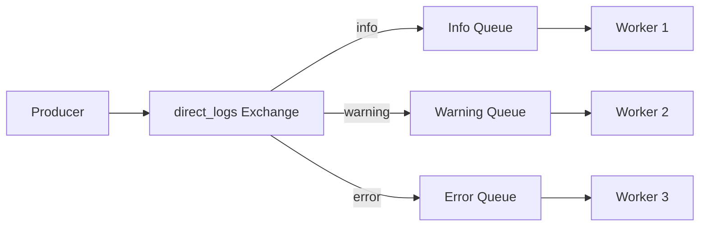
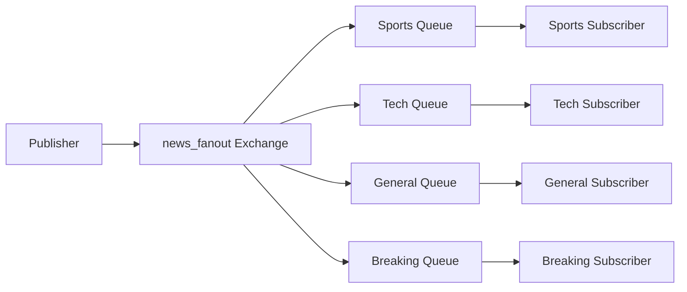

# 🐰 RabbitMQ Patterns Demo

Un proyecto completo que demuestra dos patrones fundamentales de RabbitMQ: **Routing** y **Publish/Subscribe**.

## 📋 Tabla de Contenidos

- [Descripción General](#-descripción-general)
- [Patrones Implementados](#-patrones-implementados)
- [Estructura del Proyecto](#-estructura-del-proyecto)
- [Instalación y Configuración](#-instalación-y-configuración)
- [Uso Rápido](#-uso-rápido)
- [Ejemplos Detallados](#-ejemplos-detallados)
- [Scripts de Prueba](#-scripts-de-prueba)
- [Interfaz Web](#-interfaz-web)
- [Arquitectura](#-arquitectura)

## 🎯 Descripción General

Este proyecto implementa dos patrones de mensajería fundamentales usando RabbitMQ:

1. **🔄 Routing Pattern**: Mensajes dirigidos usando routing keys (Direct Exchange)
2. **📰 Publish/Subscribe Pattern**: Difusión de mensajes a múltiples suscriptores (Fanout Exchange)

## 🏗️ Patrones Implementados

### 1. Routing Pattern (Direct Exchange)
```
Producer → Exchange (direct_logs) → Queues (por routing_key) → Workers
```

- **Exchange**: `direct_logs` (tipo: direct)
- **Routing Keys**: `info`, `warning`, `error`, `debug`
- **Uso**: Sistemas de logging con diferentes niveles de severidad

### 2. Publish/Subscribe Pattern (Fanout Exchange)
```
Publisher → Exchange (news_fanout) → Todas las Queues → Subscribers
```

- **Exchange**: `news_fanout` (tipo: fanout)
- **Routing Keys**: Se ignoran (todos reciben todo)
- **Uso**: Sistema de noticias donde todos los suscriptores reciben todas las noticias

## 📁 Estructura del Proyecto

```
RabbitMQ-03/
├── 🔄 Routing Pattern
│   ├── producer.py          # Envía logs con routing keys
│   └── worker.py           # Recibe logs específicos
├── 📰 Publish/Subscribe Pattern  
│   ├── publisher.py        # Publica noticias
│   └── subscriber.py       # Se suscribe a noticias
├── 🐳 Docker Configuration
│   ├── docker-compose.yml  # Orquestación de servicios
│   └── Dockerfile          # Imagen base Python
├── 🧪 Testing Scripts
│   ├── test.sh             # Script interactivo completo
│   ├── test-routing.sh     # Prueba rápida de routing
│   └── test-pubsub.sh      # Prueba rápida de pub/sub
└── README.md              # Esta documentación
```

## 🚀 Instalación y Configuración

### Prerrequisitos
- 🐳 Docker
- 🐳 Docker Compose
- 🐧 Linux/macOS/Windows con WSL

### Instalación
```bash
# Clonar o descargar el proyecto
cd RabbitMQ-03

# Verificar archivos
ls -la

# Dar permisos a scripts
chmod +x *.sh
```

## ⚡ Uso Rápido

### Opción 1: Script Interactivo (Recomendado)
```bash
./test.sh
```

### Opción 2: Comandos Manuales
```bash
# 1. Iniciar RabbitMQ
docker-compose up -d rabbitmq

# 2. Probar Routing
./test-routing.sh

# 3. Probar Publish/Subscribe  
./test-pubsub.sh
```

## 📖 Ejemplos Detallados

### 🔄 Routing Pattern

#### Iniciar Worker
```bash
# Worker que escucha múltiples severidades
docker-compose run --rm worker python3 /app/worker.py info warning error

# Worker que solo escucha errores críticos
docker-compose run --rm worker python3 /app/worker.py error
```

#### Enviar Mensajes
```bash
# Mensajes informativos
docker-compose run --rm producer python3 /app/producer.py info "Sistema funcionando correctamente"

# Advertencias
docker-compose run --rm producer python3 /app/producer.py warning "Memoria al 80%"

# Errores críticos
docker-compose run --rm producer python3 /app/producer.py error "Base de datos no responde"
```

### 📰 Publish/Subscribe Pattern

#### Iniciar Suscriptores
```bash
# Suscriptor de deportes (filtro local)
docker-compose run --rm subscriber python3 /app/subscriber.py "Sports Fan" SPORTS

# Suscriptor de tecnología
docker-compose run --rm subscriber python3 /app/subscriber.py "Tech Reader" TECH SCIENCE

# Suscriptor general (todas las noticias)
docker-compose run --rm subscriber python3 /app/subscriber.py "General Reader"
```

#### Publicar Noticias
```bash
# Noticia deportiva
docker-compose run --rm publisher python3 /app/publisher.py SPORTS "Final Champions" "Real Madrid vs Barcelona"

# Noticia tecnológica
docker-compose run --rm publisher python3 /app/publisher.py TECH "Nueva IA" "GPT-5 revoluciona la industria"

# Noticia urgente
docker-compose run --rm publisher python3 /app/publisher.py BREAKING "Última Hora" "Evento importante"

# Modo simulación (10 noticias automáticas)
docker-compose run --rm publisher python3 /app/publisher.py
```

## 🧪 Scripts de Prueba

### Script Principal (`test.sh`)
Menu interactivo completo con todas las opciones:
```bash
./test.sh
```

Opciones disponibles:
- 🚀 Iniciar todos los servicios
- 🔄 Probar patrón ROUTING
- 📰 Probar patrón PUBLISH/SUBSCRIBE
- 📊 Ver logs de los servicios
- 🌐 Abrir interfaz web de RabbitMQ
- 🧹 Limpiar y reiniciar
- ⛔ Detener todos los servicios

### Pruebas Específicas
```bash
# Prueba rápida de routing
./test-routing.sh

# Prueba rápida de publish/subscribe
./test-pubsub.sh
```

## 🌐 Interfaz Web

RabbitMQ incluye una interfaz web de administración:

- **URL**: http://localhost:15672
- **Usuario**: `guest`
- **Contraseña**: `guest`

### Funcionalidades
- 📊 Monitoreo de exchanges y queues
- 📈 Estadísticas de mensajes
- 🔍 Inspección de conexiones
- 📝 Envío manual de mensajes

## 🏛️ Arquitectura

### Routing Pattern (Direct Exchange)


### Publish/Subscribe Pattern (Fanout Exchange)


## 🔧 Configuración Avanzada

### Variables de Entorno
```bash
# En docker-compose.yml o .env
RABBITMQ_HOST=localhost
RABBITMQ_DEFAULT_USER=guest
RABBITMQ_DEFAULT_PASS=guest
```

### Personalizar Comportamiento
```bash
# Cambiar niveles de routing
docker-compose run --rm worker python3 /app/worker.py debug info warning error

# Suscriptor con filtros específicos
docker-compose run --rm subscriber python3 /app/subscriber.py "Mi Lector" TECH SCIENCE HEALTH

# Publisher con mensaje personalizado
docker-compose run --rm publisher python3 /app/publisher.py CUSTOM "Mi Título" "Mi contenido personalizado"
```

## 🐛 Troubleshooting

### Problemas Comunes

#### RabbitMQ no inicia
```bash
# Verificar puerto disponible
sudo netstat -tlnp | grep 5672

# Limpiar volúmenes
docker-compose down --volumes
docker-compose up -d rabbitmq
```

#### Contenedores no se conectan
```bash
# Verificar red Docker
docker network ls
docker-compose ps

# Reiniciar servicios
docker-compose restart
```

#### Logs para debugging
```bash
# Ver todos los logs
docker-compose logs

# Ver logs específicos
docker-compose logs rabbitmq
docker-compose logs worker
docker-compose logs subscriber-sports
```

## 📚 Referencias

- [RabbitMQ Official Documentation](https://www.rabbitmq.com/documentation.html)
- [RabbitMQ Tutorials](https://www.rabbitmq.com/getstarted.html)
- [Pika Python Client](https://pika.readthedocs.io/)
- [Docker Compose Reference](https://docs.docker.com/compose/)

## 🤝 Contribuciones

¡Las contribuciones son bienvenidas! 

1. Fork el proyecto
2. Crea una rama para tu feature
3. Commit tus cambios
4. Push a la rama
5. Abre un Pull Request

## 📄 Licencia

Este proyecto está bajo la Licencia MIT. Ver archivo `LICENSE` para más detalles.

---

**¡Happy Messaging! 🐰📨**
